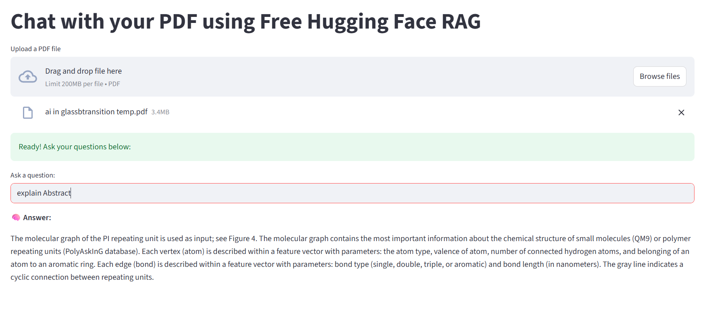

## Chat with your PDF using Free Hugging Face RAG

This Streamlit app lets you **chat with any PDF** using a **free Hugging Face Retrieval-Augmented Generation (RAG)** setup.  
It uses **LangChain**, **FAISS**, and **sentence-transformers** for document embedding & retrieval, and **FLAN-T5** for free text generation.

---

##  Features
-  Upload and process **any PDF** (up to 200MB)
-  Ask natural language questions and get answers from your PDF
-  Uses **vector search (FAISS)** for efficient information retrieval
-  Runs **entirely for free** with Hugging Face models

---

## Screenshots

### **Home Screen**


### **Example Interaction**
  
*(Replace `Screenshot2.png` with your actual second screenshot file name)*
##  Project Structure
.
├── app.py # Main Streamlit app
├── utils.py # Utility functions for PDF loading, splitting, and vector store creation
├── requirements.txt # Python dependencies
├── uploaded_files/ # Stores uploaded PDFs
└── README.md # Project documentation


##  How It Works

PDF Upload → You upload a PDF file.

Text Extraction → The app extracts text using PyPDFLoader.

Text Splitting → Large chunks are split into smaller pieces using RecursiveCharacterTextSplitter.

Embedding → Each chunk is embedded using sentence-transformers/all-MiniLM-L6-v2.

Vector Storage → FAISS stores embeddings for fast similarity search.

Question Answering → A query retrieves relevant chunks and sends them to FLAN-T5 to generate answers.

##  Notes

The app uses google/flan-t5-base from Hugging Face — this is free to use.

Ensure you have pypdf installed (it is required for PDF parsing).

Large PDFs (close to 200MB) may take longer to process.

##  License

This project is licensed under the MIT License — feel free to use and modify it.

## Future Improvements

Add chat history for better context retention.

Support for multiple PDF uploads.

Deploy on Streamlit Cloud or Hugging Face Spaces.

---


---
##  Installation & Setup
###  Clone the Repository
```bash
git clone https://github.com/yourusername/pdf-chat-rag.git
cd Langchain-Chatpd


##Create a Virtual Environment (Optional but Recommended)
python -m venv venv
source venv/bin/activate    # On Mac/Linux
venv\Scripts\activate       # On Windows


## nstall Dependencies
pip install -r requirements.txt


## Requirements

Your requirements.txt:

langchain
sentence-transformers
faiss-cpu
PyPDF2
streamlit
transformers
torch
pypdf
langchain-community


###Running the App

#Run the Streamlit app locally:

streamlit run app.py
